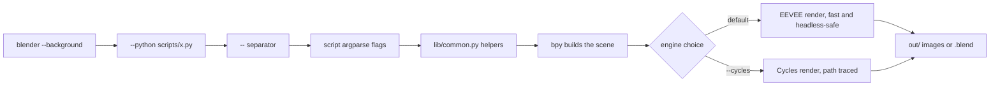

# blender-python-toolkit

Headless Blender automation with Python — procedural scenes, product turntables, batch rendering, data-driven 3D charts and scene hygiene, all runnable from the command line, EEVEE-first.


## Why

Opening Blender, clicking through menus, and re-doing the same setup for every render is fine once. It stops being fine when you need a turntable of 40 products, a chart rebuilt every time the numbers change, or the same scene pushed to three resolutions for review. Blender ships a full Python interpreter and can run **completely headless** (`blender --background --python script.py`), which turns any of those into a one-line command that fits in a Makefile, a cron job, or CI.

This toolkit is seven focused scripts plus a shared helper library. Each one does a single job, takes plain `argparse` flags, uses only `bpy` (no addons), and renders with **EEVEE by default** — because EEVEE finishes a frame in a fraction of a second and does not hang a headless session on consumer GPUs. Cycles is available behind a `--cycles` flag when you actually need path tracing.

## What is inside

| Script | Does | Key flags |
| --- | --- | --- |
| `scripts/procedural_city.py` | Seeded grid of buildings, emissive-window facades, sky + sun, auto-framed camera | `--blocks --seed --render` |
| `scripts/product_turntable.py` | Import a model, auto-center + scale, 3-point studio rig, orbit camera, turntable or still | `--model --frames --still --render` |
| `scripts/batch_render.py` | Render every `.blend` in a folder with per-file overrides and a resilient summary table | `--input --engine --resolution --samples` |
| `scripts/csv_to_bars3d.py` | Turn a `label,value` CSV into a 3D bar chart with colored bars and extruded labels | `--csv --title --render` |
| `scripts/material_library.py` | Build a `.blend` of 8 procedural PBR materials you can append into any project | `--spheres --render --out` |
| `scripts/cleanup_scene.py` | Purge orphans, apply transforms, fix negative scales, rename by type — dry-run by default | `--input --execute` |
| `scripts/render_presets.py` | Apply `preview` / `social` / `print` presets from `presets.yaml` to a `.blend` | `--preset --list --render` |
| `lib/common.py` | Shared helpers: scene reset, `look_at`, `frame_object`, sRGB→linear, engine selection | imported by every script |

## Architecture

Every script follows the same flow. Blender consumes its own flags first; everything after the `--` separator belongs to the script.



## Quickstart

```bash
git clone https://github.com/AleBrito124356/blender-python-toolkit.git
cd blender-python-toolkit

# Optional: only needed for scripts/render_presets.py, and even then it has a
# built-in fallback parser. Installs into your system Python, not Blender's.
pip install -r requirements.txt

# Optional convenience config for the Makefile targets.
cp .env.example .env          # then edit BLENDER_EXE to point at your Blender
```

**You need Blender itself** — the scripts run inside it, not under your system Python. Download it free from [blender.org/download](https://www.blender.org/download/). Anything from 3.6 through the 4.x series works; the scripts detect the version and adapt (EEVEE vs EEVEE Next, Filmic vs AgX, and the Principled BSDF socket renames in 4.0).

Run the demo turntable to confirm your setup renders:

```bash
"C:\Program Files\Blender Foundation\Blender 4.2\blender.exe" \
  --background --python scripts/product_turntable.py -- --still --render
# -> out/turntable/beauty.png
```

## How headless Blender works

**Point at the full executable path.** On Windows, `blender` is usually not on your `PATH`, so use the full path to `blender.exe`:

```powershell
& "C:\Program Files\Blender Foundation\Blender 4.2\blender.exe" --background --python scripts\procedural_city.py -- --blocks 6 --render
```

On macOS and Linux the binary is typically reachable directly:

```bash
blender --background --python scripts/procedural_city.py -- --blocks 6 --render
```

**The `--` trick.** Blender parses every argument for itself until it sees a lone `--`. Everything after that is handed to your script untouched. Each script here reads exactly those trailing arguments (see `get_argv_after_dashes` in `lib/common.py`) and feeds them to `argparse`. So this:

```
blender --background --python scripts/procedural_city.py -- --blocks 6 --seed 7 --render
        └────────── Blender's flags ──────────┘  └──────── the script's flags ───────┘
```

**EEVEE vs Cycles.** Every rendering script defaults to EEVEE and exposes an opt-in `--cycles` flag:

- **EEVEE (default)** — rasterized, renders in well under a second per frame, stable in `--background` mode. This is the right choice for turntables, chart rebuilds, look-dev, and CI. On Blender 4.2+ the toolkit automatically selects EEVEE Next.
- **Cycles (`--cycles`)** — physically-based path tracing for accurate refraction, caustics and global illumination. Slower, and on some headless consumer-GPU setups it can stall. Reach for it only when a shot genuinely needs it. The toolkit tries to enable a GPU compute backend (OptiX/CUDA/HIP/Metal/oneAPI) and falls back to CPU if none is available.

## Usage

### Procedural city

```bash
blender --background --python scripts/procedural_city.py -- --blocks 6 --seed 7 --render
```
```
[procedural_city] built 6x6 blocks (seed 7)
[procedural_city] rendering with BLENDER_EEVEE_NEXT -> .../out/city.png
[procedural_city] wrote .../out/city.png
```
A seeded layout means the same `--seed` always produces the same skyline. Windows glow through an emission shader driven by a Brick Texture, so there is no per-window geometry even on large grids.

### Product turntable

```bash
# Demo cube, 60-frame orbit:
blender --background --python scripts/product_turntable.py -- --frames 60 --render
# Your own model, single beauty shot:
blender --background --python scripts/product_turntable.py -- --model assets/shoe.glb --still --render
```
```
[turntable] imported 3 mesh object(s) from .../shoe.glb
[turntable] rendering 60 frames with BLENDER_EEVEE_NEXT -> .../out/turntable
[turntable] wrote 60 frames to .../out/turntable
```
The model is centered, scaled to a unit box, and dropped so its base sits on the floor. The key/fill/rim area lights scale with the subject. Frames land as `frame_0001.png` … ready to stitch into a video (for example with the sibling [remotion-video-templates](https://github.com/AleBrito124356/remotion-video-templates) or `ffmpeg`).

### Batch render

```bash
blender --background --python scripts/batch_render.py -- --input scenes --output out/batch --engine eevee --resolution 1920x1080 --samples 64
```
```
[batch] found 3 .blend file(s) in .../scenes
------------------------------------------------------------
FILE        STATUS     TIME  DETAIL
------------------------------------------------------------
hero        OK          2.1s  hero.png
packshot    OK          1.8s  packshot.png
broken      ERROR       0.0s  no camera in scene
------------------------------------------------------------
2/3 rendered OK, 1 failed or skipped
```
Each file is isolated in its own `try/except`, so one corrupt `.blend` never kills the run.

### CSV to 3D bars

```bash
blender --background --python scripts/csv_to_bars3d.py -- --csv data/sales.csv --title "2026 Sales" --render
```
Reads a `label,value` CSV (a 12-month sample ships in `data/sales.csv`), maps each value to a bar height and a color along a blue→teal→amber ramp, and adds extruded text labels and value numbers. Point `--csv` at your own file to rebuild the chart.

### Material library

```bash
blender --background --python scripts/material_library.py -- --spheres --render
# -> material_library.blend  and  out/materials.png
```
Builds 8 documented procedural materials — brushed metal, plastic, rubber, wood, glass, emission, car paint, ceramic — each with a fake user so it survives the save. **Append one into another project** from the Blender UI (`File ▸ Append ▸ material_library.blend ▸ Material`), or in Python:

```python
import bpy
with bpy.data.libraries.load("material_library.blend", link=False) as (src, dst):
    dst.materials = ["Car Paint"]              # link=True to keep a live link instead
obj.data.materials.append(bpy.data.materials["Car Paint"])
```

### Cleanup scene

```bash
# Dry run first (default) - reports what it would change, writes nothing:
blender --background --python scripts/cleanup_scene.py -- --input messy.blend
# Then actually apply and save messy_clean.blend:
blender --background --python scripts/cleanup_scene.py -- --input messy.blend --execute
```
Purges orphan datablocks, applies transforms on single-user meshes, flips negative scales (and their normals), and renames objects with a type prefix (`MESH_`, `CAM_`, `LGT_`, …). It **never overwrites the input** — cleaned output goes to `<name>_clean.blend`.

### Render presets

```bash
blender --background --python scripts/render_presets.py -- --list
blender --background --python scripts/render_presets.py -- --input scene.blend --preset social --render
```
```
Available presets:
  preview    960x540  eevee  16 samples
  social     1080x1080  eevee  64 samples
  print      3840x2160  eevee  256 samples
```
Presets live in `presets.yaml`. Color management follows the Blender version — AgX on 4.0+, Filmic before — so renders match the interactive default. PyYAML is used if present; if not, a small built-in parser reads the file so the script still runs inside stock Blender.

## Gallery

| Output | Produced by | What you get |
| --- | --- | --- |
| `out/city.png` | `procedural_city.py` | A dusk skyline with lit windows, seeded and reproducible |
| `out/turntable/frame_*.png` | `product_turntable.py` | A 360° orbit of any model on a neutral studio floor |
| `out/bars3d.png` | `csv_to_bars3d.py` | A colored 3D bar chart with labels straight from a CSV |
| `out/materials.png` | `material_library.py` | A contact sheet of the 8 procedural PBR spheres |
| `out/batch/*.png` | `batch_render.py` | One image per source `.blend`, named after the file |

## Project structure

```
blender-python-toolkit/
├── scripts/
│   ├── procedural_city.py      # seeded city block, emissive windows
│   ├── product_turntable.py    # 3-point rig + orbit camera
│   ├── batch_render.py         # render a whole folder of .blend files
│   ├── csv_to_bars3d.py        # CSV -> 3D bar chart
│   ├── material_library.py     # 8 procedural PBR materials -> .blend
│   ├── cleanup_scene.py        # scene hygiene, dry-run by default
│   └── render_presets.py       # preview / social / print presets
├── lib/
│   ├── __init__.py
│   └── common.py               # shared bpy helpers (imported by every script)
├── data/
│   └── sales.csv               # sample data for the bar chart
├── presets.yaml                # render preset definitions
├── Makefile                    # convenience targets (make city, make bars, ...)
├── requirements.txt            # PyYAML (optional); bpy ships with Blender
├── .env.example                # BLENDER_EXE path + render defaults
├── .gitignore
└── LICENSE
```

## Extending with your own script

Every script is the same shape. Drop this into `scripts/`, and it inherits the shared helpers and the `--` argument handling:

```python
"""My script. Run: blender --background --python scripts/my_script.py -- --foo 3"""
import argparse, os, sys

import bpy

sys.path.insert(0, os.path.dirname(os.path.dirname(os.path.abspath(__file__))))
from lib.common import clean_default_scene, new_camera, set_engine, get_argv_after_dashes


def main():
    parser = argparse.ArgumentParser(prog="my_script.py")
    parser.add_argument("--foo", type=int, default=1)
    args = parser.parse_args(get_argv_after_dashes())

    clean_default_scene()
    # ... build your scene with bpy here ...
    set_engine(bpy.context.scene, "eevee")
    print(f"[my_script] done with foo={args.foo}")


if __name__ == "__main__":
    main()
```

`lib/common.py` gives you `clean_default_scene`, `look_at`, `frame_object`, `world_bounds`, `srgb_to_linear`, `hex_to_linear_rgba`, `ramp_color`, `set_engine`, `set_samples`, `set_view_transform`, and a few object-creation conveniences — all version-aware and headless-safe.

## Related projects

Part of a set of tools by the same author:

- **[python-automation-toolbox](https://github.com/AleBrito124356/python-automation-toolbox)** — 20 standalone Python automation scripts for real life, each self-contained with `argparse` and zero shared state. The general-purpose counterpart to this 3D-focused toolkit.
- **[remotion-video-templates](https://github.com/AleBrito124356/remotion-video-templates)** — Six programmatic video templates in React/Remotion, including data-driven charts. Stitch turntable frames or feed the same data into a video.
- **[pdf-power-tools](https://github.com/AleBrito124356/pdf-power-tools)** — One CLI for everything PDF: merge, split, watermark, OCR, extract. Same philosophy — a tested Python library plus a command-line tool.
- **[docker-compose-stacks](https://github.com/AleBrito124356/docker-compose-stacks)** — Copy-paste Docker Compose stacks for a dev machine, with healthchecks and env-templated secrets. Handy for wiring a render node into a larger pipeline.

## License

MIT © 2026 Alejandro Brito. See [LICENSE](LICENSE).
