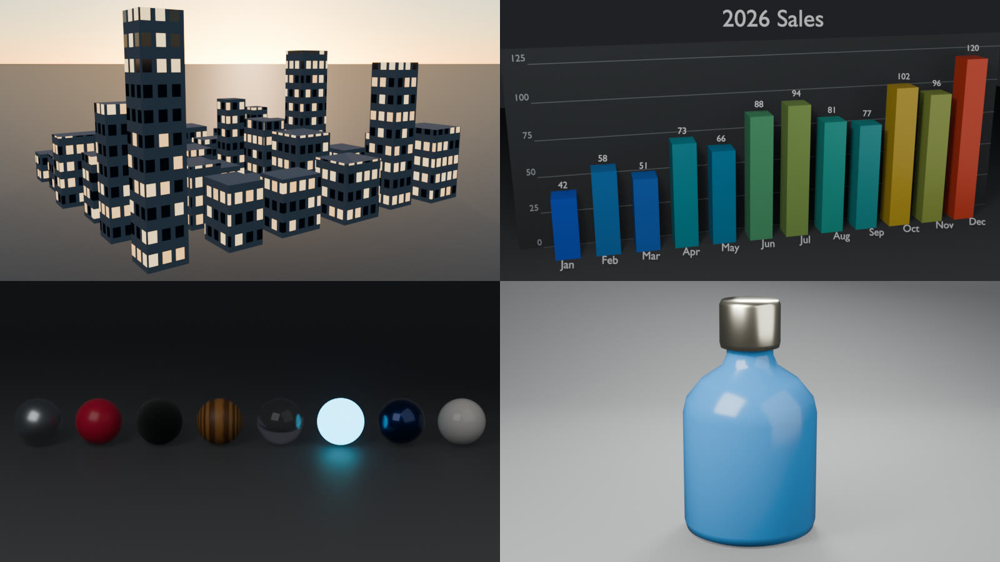
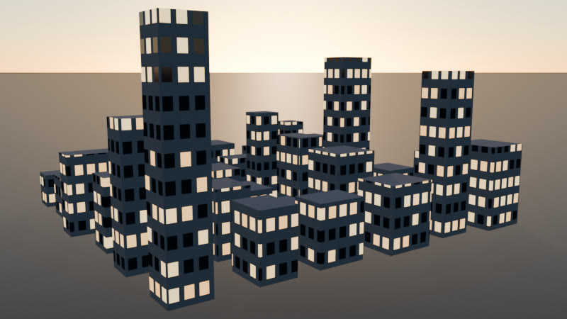
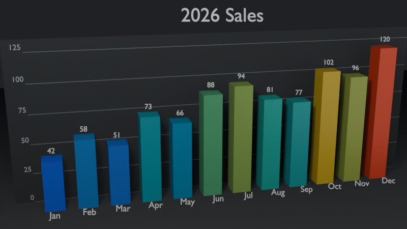
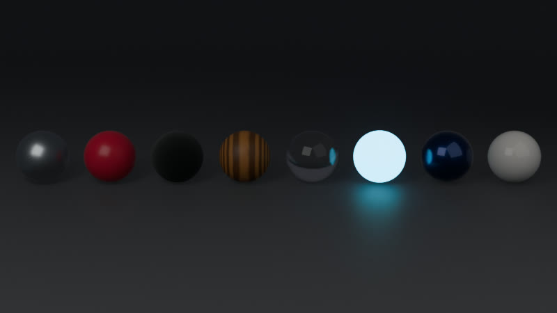
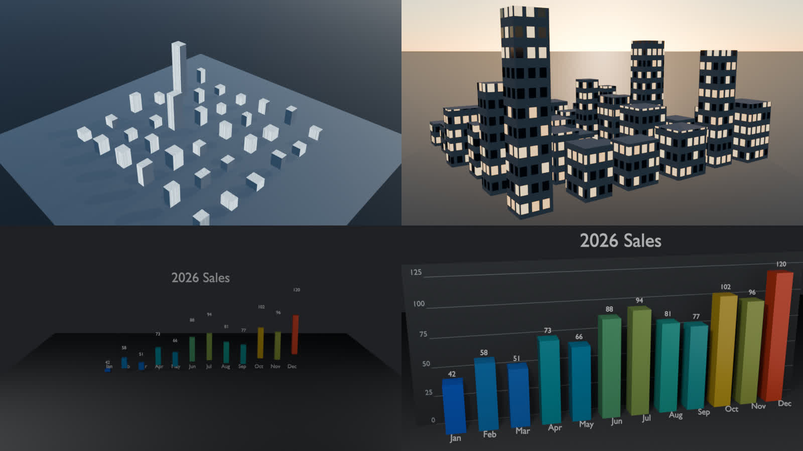

# blender-python-toolkit

Headless Blender automation with Python: procedural scenes, product turntables, batch rendering, data-driven 3D charts and scene hygiene, all runnable from one command, EEVEE-first, and every render checked by numbers instead of by eye.




## Why

Opening Blender, clicking through menus, and re-doing the same setup for every render is fine once. It stops being fine when you need a turntable of 40 products, a chart rebuilt every time the numbers change, or the same scene pushed to three resolutions for review. Blender ships a full Python interpreter and runs **completely headless**, which turns each of those into a one-line command for a Makefile, a cron job or CI.

Headless also means nobody looks at the output. So every rendering script can write a **JSON QA report** that says, with thresholds, whether the subject is cropped, floating, hidden or too small, and whether the image is black or blank. A CI job, a cron script or an AI agent without vision can reject a bad render on its own.

## What is inside

| Command | Script | Does |
| --- | --- | --- |
| `bpt city` | `scripts/procedural_city.py` | Seeded city at dusk: full-size buildings on the ground, a window grid on all four walls with per-window lighting, a physical dusk sky, camera fitted to the skyline |
| `bpt turntable` | `scripts/product_turntable.py` | Import a model (.glb/.gltf/.obj/.fbx/.stl/.ply) or use the demo bottle, rest it on the floor, 3-point rig that orbits with the camera; PNG frames, a still, or an MP4 |
| `bpt bars` | `scripts/csv_to_bars3d.py` | CSV to an honest 3D bar chart: zero baseline, gridlines, labels in front, negative values, optional animated grow-in to MP4 |
| `bpt materials` | `scripts/material_library.py` | A `.blend` of 8 procedural PBR materials (fake users, ready to Append) and a contact-sheet preview |
| `bpt batch` | `scripts/batch_render.py` | Render every `.blend` in a folder with overrides; `summary.json`/`summary.csv`; exit code 1 when anything fails |
| `bpt presets` | `scripts/render_presets.py` | Apply validated `preview` / `social` / `print` presets from `presets.yaml`, then save and/or render |
| `bpt cleanup` | `scripts/cleanup_scene.py` | Purge orphans, apply transforms, bake mirrored scales with correct normals, collision-free type-prefix renames; dry-run by default |
| `bpt inspect` | `scripts/inspect_render.py` | QA report for any `.blend` and rendered image |
| `bpt doctor` | `bpt/cli.py` | Shows which Blender, engines, GPU backends, FFmpeg, numpy and PyYAML the toolkit will use |

Shared code: `lib/core.py` (pure Python: parsing, chart layout, preset validation, QA rules; unit-tested without Blender), `lib/common.py` (version-aware `bpy` helpers), `lib/qa.py` (in-Blender measurements for the QA reports).

## Quickstart

You need [Blender](https://www.blender.org/download/) (tested on **5.2.1 LTS**) and any Python 3.9+ for the launcher.

```bash
git clone https://github.com/AleBrito124356/blender-python-toolkit.git
cd blender-python-toolkit
python -m venv .venv
.venv/Scripts/python -m pip install -e .      # Windows; on macOS/Linux: .venv/bin/python -m pip install -e .
bpt doctor                                     # or, without installing: python -m bpt doctor (from the repo root)
```

`bpt doctor` on the machine this was developed on:

```
  Blender          5.2.1 LTS  (C:\Program Files\Blender Foundation\Blender 5.2\blender.exe, via install)
  Python           3.13.13 (bundled with Blender)
  Engines          BLENDER_EEVEE, BLENDER_WORKBENCH, CYCLES
  Cycles GPU       none found -> Cycles renders on the CPU (EEVEE is unaffected)
  Video output     FFmpeg built in: --video mp4/mkv/webm works
  numpy            2.3.4 -> render QA (--report) available
  PyYAML           not installed -> presets use the built-in parser (fine). Optional: "C:\Program Files\Blender Foundation\Blender 5.2\5.2\python\bin\python.exe" -m pip install pyyaml
  ffprobe on PATH  C:\...\ffmpeg-8.1-essentials_build\bin\ffprobe.EXE
  bpt              0.2.0 (scripts in C:\...\blender-python-toolkit\scripts)
```

Blender is found in this order: `--blender PATH`, the `BLENDER_EXE` environment variable, `blender` on `PATH`, then the newest version in the usual install folders (`Program Files\Blender Foundation\Blender X.Y`, Steam, `/Applications/Blender*.app`, `/opt/blender*`, snap, flatpak).

Render something:

```bash
bpt turntable --still --render --report out/turntable.qa.json
# -> out/turntable/beauty.png and a QA report
```

`bpt` only launches Blender. `bpt --dry-run city --blocks 6 --render` prints the exact command it would run:

```
"C:\Program Files\Blender Foundation\Blender 5.2\blender.exe" --background --factory-startup --python-exit-code 1 --python C:\...\scripts\procedural_city.py -- --blocks 6 --render
```

## How headless Blender works (and the three flags that matter)

Without `bpt` you run Blender yourself. Always pass these three flags:

```bash
blender --background --factory-startup --python-exit-code 1 --python scripts/procedural_city.py -- --blocks 6 --render
```

- **`--background`** runs without a window.
- **`--python-exit-code 1`**: without it, a Python exception inside the script still ends with exit code **0**, so a Makefile or CI job never notices. (`sys.exit(n)` from a script is passed through either way; the toolkit uses that for its own exit codes.)
- **`--factory-startup`** ignores your preferences and add-ons, so a render on your desk matches a render in CI.

**The `--` trick.** Blender parses every argument for itself until a lone `--`. Everything after it is left for the script (`lib.core.get_argv_after_dashes`), which feeds it to `argparse`:

```
blender --background --python scripts/procedural_city.py -- --blocks 6 --seed 7 --render
        └──────────── Blender's flags ────────────┘  └──────── the script's flags ───────┘
```

**Why there is no `--cycles` flag.** Blender's Cycles add-on *also* reads the arguments after `--` with its own `argparse` parser, which knows `--cycles-device` and `--cycles-print-stats` and accepts abbreviations. A script flag named `--cycles` is an ambiguous abbreviation to it, so Blender exits with code 2 (`ambiguous option: --cycles could match --cycles-print-stats, --cycles-device`) before the script starts. The toolkit uses `--engine cycles` and `--device gpu|cpu` instead. (A test documents this Blender behaviour.)

**EEVEE vs Cycles.**

- **EEVEE (default)**: rasterised, fast, stable in background mode. The right choice for turntables, chart rebuilds, look-dev and CI.
- **Cycles (`--engine cycles`)**: path traced, slower. With `--device gpu` (the default) the toolkit tries OptiX, CUDA, HIP, oneAPI and Metal in that order and falls back to the CPU with a message when none works; `--device cpu` skips the GPU.

## Usage

Every example uses `bpt`; the raw Blender form is `blender --background --factory-startup --python-exit-code 1 --python scripts/<script>.py -- <same flags>`. The four generators (`city`, `turntable`, `bars`, `materials`) share `--res WxH`, `--samples N`, `--engine eevee|cycles`, `--device gpu|cpu`, `--report PATH` and `--qa-strict`; `batch` takes `--resolution`, `--samples`, `--engine`, `--device` and writes its QA into `summary.json`; `presets` and `inspect` also take `--report` / `--qa-strict`. Every script answers `--help` (`bpt city --help`).

### Procedural city

```bash
bpt city --blocks 6 --seed 7 --render --report out/city.qa.json
```
```
[procedural_city] built 6x6 blocks (seed 7), sky=MULTIPLE_SCATTERING
[procedural_city] rendering with BLENDER_EEVEE -> ...\out\city.png
QA PASS  (procedural_city)  pass=8 warn=0 fail=0 skip=0
  [PASS] camera             camera 'CityCamera'
  [PASS] behind_camera      nothing is behind the camera
  [PASS] in_frame           all 36 subject/annotation object(s) fully in frame
  [PASS] ground_contact     36 grounded object(s) rest on the ground
  [PASS] coverage           subjects cover 43.5% of the frame
  [PASS] image_exposure     mean luminance 0.265
  [PASS] image_detail       luminance std 0.225
  [PASS] image_clipping     0.0% clipped, 6.4% crushed
```
The same `--seed` always gives the same skyline. Buildings are exact boxes built at their real size, so `Object` texture coordinates are in metres: the facade projects a window grid onto all four walls (`u = (x + y) / 1.3 m`, `v = z / 2.1 m`), a White Noise of each window's cell id decides whether it is lit (`--lit 0.55`) and its tint, and roofs get none. The sky uses the best physical model the Blender build has (`MULTIPLE_SCATTERING` on 5.x, `NISHITA` on 2.90-4.x) and the script prints which one it used. `--sun-elevation` moves the sun (2-6 degrees reads as dusk).

### Product turntable

```bash
# 60-frame orbit straight to an H.264 MP4, seamless curved backdrop:
bpt turntable --frames 60 --render --video mp4 --backdrop cyclorama
# Your own model, single beauty shot with a QA report:
bpt turntable --model assets/shoe.glb --still --render --report out/shoe.qa.json
```
```
[turntable] no --model given; using the demo bottle
[turntable] rendering 60 frames with BLENDER_EEVEE -> ...\out\turntable\turntable.mp4
[turntable] wrote ...\out\turntable\turntable.mp4
```
The model is centred, scaled to a 2-unit box and dropped so its lowest **vertex** touches the floor (measured on the evaluated mesh, so rotated imports and modifiers are handled). The key/fill/rim lights are parented to the orbit together with the camera, so the lighting is identical on every frame, like a product spinning on a real turntable. The camera is fitted to the model over the whole orbit for the render's aspect ratio. Without `--video`, frames land as `frame_0001.png ...`; the 360-degree key sits on frame N+1, so the loop has no duplicated frame. `--backdrop none` renders on a transparent background.

### CSV to 3D bars

```bash
bpt bars --csv data/sales.csv --title "2026 Sales" --render
bpt bars --csv data/profit_margin.csv --value-col margin_pct --title "Margin %" --render
bpt bars --csv data/sales.csv --animate --render --video mp4        # staggered, eased grow-in
```
```
[bars3d] skipped line 7: value 'n/a' is not a number (not a number: 'n/a')
[bars3d] built 5 bars from ...\data\profit_margin.csv (label='region', value='margin_pct', 1 skipped)
```
Heights are **proportional to the values on a zero baseline**: in `data/sales.csv` December (120) is exactly 2.86 times as tall as January (42). Negative values hang below a zero-axis plate. A back panel carries gridlines at round tick values; category labels stand in front of the bars and value labels above them, turned towards the camera and shrunk to fit their slot. The reader sniffs `,` `;` TAB `|`, understands `1,234.5`, `1.234,5`, `3,5`, `$1,200` and `(1,200)`, picks the first numeric column unless you pass `--value-col`, and reports every row it skips with its line number (`--strict-csv` turns skipped rows into exit code 2). `--sort asc|desc` orders the bars.

### Material library

```bash
bpt materials --spheres --render
# -> material_library.blend  and  out/materials.png
```
Builds 8 documented procedural materials: brushed metal, plastic, rubber, wood, glass, emission, car paint and ceramic. Each has a fake user so it survives the save. The preview camera is fitted to the sphere row for the preview's aspect ratio, and EEVEE ray tracing is on so the glass refracts. **Append one into another project** from the Blender UI (`File > Append > material_library.blend > Material`), or in Python:

```python
import bpy
with bpy.data.libraries.load("material_library.blend", link=False) as (src, dst):
    dst.materials = ["Car Paint"]              # link=True to keep a live link instead
obj.data.materials.append(bpy.data.materials["Car Paint"])
```

### Batch render

```bash
bpt batch --input scenes --output out/batch --resolution 1920x1080 --samples 64
```
```
------------------------------------------------------------
FILE      STATUS        TIME  DETAIL
------------------------------------------------------------
corrupt   ERROR         0.0s  cannot open .blend: Missing DNA block
hero      OK            1.6s  hero.png
nocam     SKIPPED       0.5s  no active camera
videoout  OK            0.5s  videoout.png
------------------------------------------------------------
2/4 rendered OK, 2 failed or skipped
------------------------------------------------------------
[batch] summary -> ...\out\batch\summary.json
[batch] summary -> ...\out\batch\summary.csv
[batch] exiting with code 1 (errors)
```
Each file is isolated, so one corrupt `.blend` never stops the batch, and the output format is forced safely even for files saved with video output. **Exit code 1** when any file errors; files without a camera are `SKIPPED` and only fail with `--strict`; `--qa-strict` also fails files whose QA report fails. `summary.json` embeds a full QA report per rendered file (`--no-qa` to skip); `summary.csv` has one row per file.

### Render presets

```bash
bpt presets --list
bpt presets --input scene.blend --preset social --save            # -> scene_social.blend, input untouched
bpt presets --input scene.blend --preset print --render           # -> out/print.png
bpt presets --input scene.blend --preset preview --in-place       # overwrite the input (explicit)
```
```
Available presets (builtin parser, ...\presets.yaml):
  preview    960x540  eevee   16 samples  PNG
  social     1080x1080  eevee   64 samples  PNG  transparent
  print      3840x2160  eevee   256 samples  PNG
```
Applying a preset only changes the scene in memory, so choose `--save` (a new `<name>_<preset>.blend` that never overwrites: `_01`, `_02`... are appended), `--in-place` or `--render`. Presets are validated before anything is touched: a typo such as `resolutoin:` or `engine: luxcore` is an error that lists every problem. The output extension follows the preset `format` (`JPEG` writes `.jpg`). PyYAML is used when Blender's Python has it; otherwise the built-in parser reads the file. (`pip install pyyaml` into your system Python never reaches Blender; `bpt doctor` prints the command for Blender's own Python.)

### Cleanup scene

```bash
bpt cleanup --input messy.blend                 # dry run: report only
bpt cleanup --input messy.blend --execute --json out/cleanup.json
```
```
transforms applied      : 1
negative scales fixed   : 1
mirrored, shared mesh   : 1 (left as is)
orphan blocks purged    : 0
objects renamed         : 4
  ! MESH_SharedA: scale (1.0, -1.0, 1.0) shares mesh 'Cube.001' with 1 other object(s); make it single-user to fix
```
Purges orphan datablocks, applies transforms on single-user meshes, bakes mirrored (negative) scales into the mesh with outward normals, and renames objects with a type prefix (`MESH_`, `CAM_`, `LGT_`, ...) without name collisions. Mirrored objects that share their mesh are reported and left alone, because baking would flip the other users too. It **never overwrites the input**: the result goes to `<name>_clean.blend` (or `--output`).

## Checking renders without looking at them

Add `--report out/x.qa.json` to any rendering script (and `--qa-strict` to make a failed check exit with code 3), or audit any existing file:

```bash
bpt inspect --input scene.blend --render out/scene.png --report out/scene.qa.json --qa-strict
bpt inspect --input shot.blend --image renders/shot.png --frames 1-120:10
```

What is measured, and when it fails:

| Check | How | Fails when | Warns when |
| --- | --- | --- | --- |
| `camera` | scene camera | there is none | |
| `behind_camera` | depth of every evaluated vertex | part of a subject is behind the camera or its near clip | |
| `in_frame` | every vertex projected through the camera (a vectorised `world_to_camera_view`, tested against it) | a subject or label is cropped by the frame edge or outside it | |
| `ground_contact` | lowest vertex vs the ground (declared, or the largest flat mesh at the bottom) | a grounded subject floats | it sinks below the ground |
| `coverage` | convex-hull silhouettes rasterised on a grid | subjects cover < 0.5% of the frame | < 8% |
| `annotation_occluded` | rays from the camera to each label | a label is > 50% hidden | > 10% hidden |
| `annotation_overlap` | projected label boxes | | two labels overlap |
| `image_exposure` | mean display luminance (Blender's numpy on the written file) | black frame | very dark or washed out |
| `image_detail` | luminance standard deviation | flat, uniform frame | |
| `image_alpha` | alpha coverage of transparent renders | nothing opaque | |
| `image_clipping` | share of pixels at the white / black point | | > 10% clipped or > 60% crushed |

The inspector flags each deliberately broken scene in the test-suite (a camera aimed off a sphere, a scene without lights, a floating sphere):

```
QA FAIL  (inspect:qa_float.blend)  pass=7 warn=0 fail=1 skip=0
  [PASS] camera             camera 'Camera'
  [PASS] behind_camera      nothing is behind the camera
  [PASS] in_frame           all 1 subject/annotation object(s) fully in frame
  [FAIL] ground_contact     1 object(s) float above the ground (worst gap 1)
         -> Ball
  ...
```

The JSON report holds the same checks plus the numbers behind them: scene facts (engine, resolution, samples, view transform, frame range, camera, lights, sky type, output format), per-object projected bounding boxes, lowest points, ground gaps and occlusion, coverage per frame, and image statistics. `report["passed"]` is `false` exactly when a check has `"status": "fail"`; `lib.core.validate_report` checks the structure.

**Object roles.** The toolkit's scripts tag what they build with a `qa_role` custom property: `subject` (must be in frame and rest on the ground), `annotation` (labels and titles: in frame, may float, must not be hidden), `backdrop` (floors, panels, cycloramas: ignored) or `ignore`. Untagged files get defaults: the largest flat mesh at the bottom is the ground, text objects are annotations, everything else is a subject. `lib.common.tag_role(obj, "annotation")` tags your own objects; `bpt inspect --ground-z Z` or `--no-ground-check` override the ground.

## Exit codes

| Code | Meaning |
| --- | --- |
| 0 | success |
| 1 | a Python error (with `--python-exit-code 1`), bad input such as a missing file, or a batch with failed files |
| 2 | invalid command-line flags (argparse), `--strict-csv` with skipped rows, or Blender rejecting its own arguments |
| 3 | `--qa-strict` and at least one QA check failed |

## Tests

```bash
.venv/Scripts/python -m pip install -r requirements.txt -e .
.venv/Scripts/python -m pytest tests/unit          # 167 tests, no Blender needed, a few seconds
.venv/Scripts/python -m pytest -m blender          # runs every script in a headless Blender (~4 min)
```

The integration tests generate their `.blend` / `.glb` fixtures at test time, run each script with `--background --factory-startup --python-exit-code 1` at tiny resolutions, and measure the results with Blender's own APIs: floor contact of buildings, bars and a rotated `.glb`, full building dimensions, a window grid on all four walls (rendered and profiled), bar height ratios, label positions, framing at the default resolutions, linear turntable keys, MP4 frame counts, batch exit codes and summaries, preset saving, outward normals after cleanup, and the QA verdict on good and broken scenes. They skip cleanly when no Blender is found (`BLENDER_EXE` overrides discovery).

`make test`, `make city`, `make bars` and friends exist for people who have `make`; each target is a single `python -m bpt ...` line.

## Compatibility

Tested on **Blender 5.2.1 LTS** (Windows 11; EEVEE, and Cycles on the CPU). The helpers keep the version branches for older releases: `BLENDER_EEVEE_NEXT` on 4.2-4.4, legacy `Action.fcurves` before layered actions, `NISHITA` / Hosek-Wilkie skies, pre-4.0 Principled BSDF socket names, Filmic before AgX, and no `media_type` before 5.0. Those branches are kept on purpose for 3.6-4.x but are **not exercised by this repository's tests**, so treat them as best effort.

## Gallery

Rendered with the commands below plus `--res 800x450 --samples 64` (EEVEE), every QA check passing:

| | |
| --- | --- |
|  |  |
| `bpt city --blocks 6 --seed 7 --render` | `bpt bars --title "2026 Sales" --render` |
|  |  |
| `bpt materials --spheres --render` | `bpt turntable --still --backdrop cyclorama --render` |

Version 0.1 (left) against 0.2 (right) with the same seed, CSV and resolution: floating half-size buildings with streaked facades and a daytime sky, and a min-max-scaled chart with hidden labels, became grounded buildings with lit windows at dusk and a zero-baseline chart:



## Project structure

```
blender-python-toolkit/
├── bpt/                        # launcher: discovery, doctor, one sub-command per script
├── scripts/
│   ├── procedural_city.py      # seeded city at dusk
│   ├── product_turntable.py    # 3-point rig + orbit camera, PNG / still / MP4
│   ├── batch_render.py         # render a folder of .blend files, CI exit code
│   ├── csv_to_bars3d.py        # CSV -> 3D bar chart (still or animated)
│   ├── material_library.py     # 8 procedural PBR materials -> .blend
│   ├── cleanup_scene.py        # scene hygiene, dry-run by default
│   ├── render_presets.py       # preview / social / print presets
│   └── inspect_render.py       # QA report for any .blend / image
├── lib/
│   ├── core.py                 # pure Python, unit tested without Blender
│   ├── common.py               # version-aware bpy helpers (imported by every script)
│   └── qa.py                   # in-Blender measurements for QA reports
├── tests/
│   ├── unit/                   # system Python, no Blender
│   └── blender/                # headless Blender integration tests, probes, fixture generator
├── data/                       # sales.csv, profit_margin.csv
├── docs/gallery/               # renders shown above
├── presets.yaml                # render preset definitions (validated)
├── pyproject.toml              # `bpt` console script, pytest config
├── Makefile                    # optional shortcuts to `python -m bpt`
├── requirements.txt            # dev/test dependencies for the system Python
└── CHANGELOG.md
```

## Extending with your own script

Every script has the same shape. Drop this into `scripts/` and run it with `bpt run scripts/my_script.py --foo 3 --render`; it inherits the shared flags, the `--` handling and the QA report:

```python
"""My script. Run: bpt run scripts/my_script.py --foo 3 --render --report out/mine.qa.json"""
import argparse, os, sys

import bpy

sys.path.insert(0, os.path.dirname(os.path.dirname(os.path.abspath(__file__))))
from lib.common import (add_box, add_render_args, apply_render_settings, clean_default_scene,
                        frame_objects, get_argv_after_dashes, new_camera, render_still, run_qa, tag_role)


def main():
    parser = argparse.ArgumentParser(prog="my_script.py")
    parser.add_argument("--foo", type=int, default=1)
    parser.add_argument("--render", action="store_true")
    add_render_args(parser, res="1280x720", samples=32)   # --res --samples --engine --device --report --qa-strict
    args = parser.parse_args(get_argv_after_dashes())

    clean_default_scene()
    scene = bpy.context.scene
    apply_render_settings(scene, args)                      # sets the aspect ratio used for framing
    boxes = [tag_role(add_box(f"Box{i}", 1, 1, 1 + i, location=(i * 1.5, 0)), "subject")
             for i in range(args.foo)]
    frame_objects(new_camera(), boxes, margin=1.1)
    images = [render_still(scene, "out/mine.png")] if args.render else []
    run_qa(args, "my_script", images=images)                # honours --report / --qa-strict


if __name__ == "__main__":
    main()
```

`lib/common.py` also gives you `action_fcurves` (layered actions), `set_image_output` / `set_video_output` (media-type safe), `configure_sky`, `mesh_world_bounds`, `frame_points`, `set_engine`, `look_at`, colour helpers and more, all headless-safe.

## Related projects

Part of a set of tools by the same author:

- **[python-automation-toolbox](https://github.com/AleBrito124356/python-automation-toolbox)**: 20 standalone Python automation scripts for real life, each self-contained with `argparse` and zero shared state. The general-purpose counterpart to this 3D-focused toolkit.
- **[remotion-video-templates](https://github.com/AleBrito124356/remotion-video-templates)**: six programmatic video templates in React/Remotion, including data-driven charts. Feed the same data into a video.
- **[pdf-power-tools](https://github.com/AleBrito124356/pdf-power-tools)**: one CLI for everything PDF: merge, split, watermark, OCR, extract.
- **[docker-compose-stacks](https://github.com/AleBrito124356/docker-compose-stacks)**: copy-paste Docker Compose stacks for a dev machine, with healthchecks and env-templated secrets.

## License

MIT © 2026 Alejandro Brito. See [LICENSE](LICENSE).
